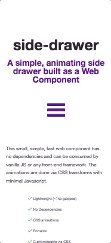

 [](https://www.webcomponents.org/element/side-drawer) [](https://npmjs.org/package/side-drawer)

# side-drawer

A simple, animating side drawer built as a Web Component



## [Demo](https://side-drawer.netlify.com/)

## Installation

You can integrate side-drawer via `<script>` tag or via NPM.

### Via `<script>` tag

In the `<head>` of your index.html put a script tag like this:

```html
<script
  type="module"
  src="https://unpkg.com/side-drawer/side-drawer.js"
></script>

<!-- Or use the minified version -->
<script
  type="module"
  src="https://unpkg.com/side-drawer/side-drawer.min.js"
></script>
```

Now you can use the `side-drawer` element anywhere in your html, JSX, template, etc.

### Via NPM

```bash
npm install side-drawer --save
```

And then you need to import the module before you can use it in your html/jsx/template:

```js
import "side-drawer";
```

## Web Component Browser Support

This web component uses [HTML templates](https://caniuse.com/#feat=template), the [shadow DOM](https://caniuse.com/#feat=shadowdomv1), and [custom elements](https://caniuse.com/#feat=custom-elementsv1). If you need to polyfill for any of these standards then [take a look at the web components polyfill](https://github.com/webcomponents/webcomponentsjs).

## API and Customization

### Attributes/Properties

- `open`
  - Add this attribute to open the drawer.
    - Example: `<side-drawer open></side-drawer>`
  - Set the property in Javascript to imperatively toggle the drawer
    - Example: `drawer.open = true`
  - In (p)react you might need to set undefined in your JSX (since false !== undefined for html attribute existence)
    - Example: `<side-drawer open={this.state.isDrawerOpen || undefined}></side-drawer>`

### Events

- `open`
  - Raised when the drawer is opened.
  - Example: `drawer.addEventListener("open", handleOpen())`
  - When subscribing in html listen for `onopen`
    - Ex: `<side-drawer onopen="handleOpen()">`
- `close`
  -Raised when the drawer is closed.
  - Example: `drawer.addEventListener("close", handleClose())`
  - When subscribing in html listen for `onclose`
    - Ex: `<side-drawer onclose="handleClose()">`

### Styling

You can style the side-drawer element as you would any regular element, in CSS. A list of supported CSS properties are below, along with the default values.

```css
side-drawer {
  background-color: #ffffff;
  color: inherit;
  width: 350px;
  max-width: 75vw;
  border-top-right-radius: 0;
  border-bottom-right-radius: 0;
}
```

You can customize styling with the following CSS variables:

| Variable                           | Default                    | Description                                                                                                      |
| ---------------------------------- | -------------------------- | ---------------------------------------------------------------------------------------------------------------- |
| `--side-drawer-transition`         | `transform 0.25s ease-out` | The open/close transition for the drawer                                                                         |
| `--side-drawer-backdrop-filter`    | `none`                     | The backdrop-filter for both the drawer and the overlay that appears to the right of the drawer (when it's open) |
| `--side-drawer-overlay-transition` | `opacity linear 0.25s`     | The transition for the overlay that appears to the right of the drawer (when it's open)                          |
| `--side-drawer-overlay-opacity`    | `0.7`                      | The opacity of the overlay                                                                                       |

## Contribute

This project is built with standard HTML/CSS/JS, no frameworks or special web-component compilers here (for maximum simplicity and minimum size). If you want to learn more about writing custom elements see [MDN](https://developer.mozilla.org/en-US/docs/Web/Web_Components/Using_custom_elements) or [this web.dev page](https://web.dev/web-components/).

The source for this web component is contained in [side-drawer.js](side-drawer.js) and example usage is in [index.html](index.html). To debug/run the example you can just open index.html in a browser. For a hot-reload developer experience try [using live server in vscode](https://marketplace.visualstudio.com/items?itemName=ritwickdey.LiveServer).

You will need the dev dependencies of this project installed to run the post-commit hooks.

```bash
npm install
```
